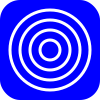

### Overview

Build xml / html / svg programatically using element building blocks.
Instead of using a templating engine, write data/markup that 'looks like' rust.

Find it on [github](https://github.com/tiby312/tagger) and [crates.io](https://crates.io/crates/tagger).

### Example

```rust
use tagger::prelude::*;
fn main() -> core::fmt::Result {
    let width = 100.0;
    let height = 100.0;

    let mut root = tagger::Element::new(tagger::upgrade(std::io::stdout()));

    root.elem("svg", |header| {
        let svg = header.write(|b| {
            b.attr("xmlns", "http://www.w3.org/2000/svg")?
                .with_attr("viewBox", wr!("0 0 {} {}", width, height))
        })?;

        svg.single("rect", |w| {
            w.attr("x1", 0)?
                .attr("y1", 0)?
                .attr("rx", 20)?
                .attr("ry", 20)?
                .attr("width", width)?
                .attr("height", height)?
                .attr("style", "fill:blue")
        })?;

        //Add styling for test class.
        svg.elem_no_attr("style", |style| {
            write!(style, "{}", ".test{fill:none;stroke:white;stroke-width:3}")
        })?;

        //Draw some circles
        svg.elem("g", |header| {
            let g = header.write(|w| w.attr("class", "test"))?;
            for r in (0..50).step_by(10) {
                g.single("circle", |w| {
                    w.attr("cx", 50.0)?.attr("cy", 50.0)?.attr("r", r)
                })?;
            }
            Ok(g)
        })?;

        Ok(svg)
    })?;

    Ok(())
}

```


### Output



